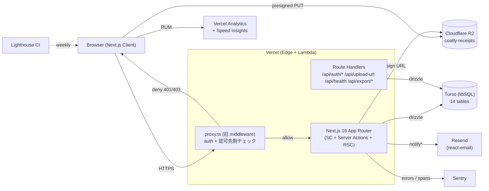
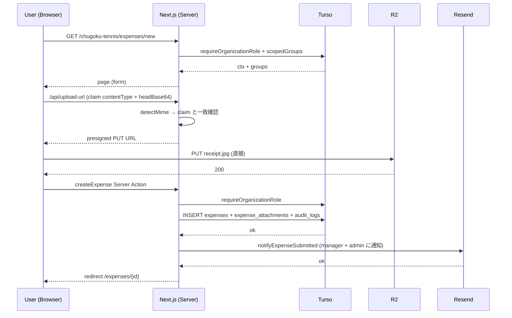

# Coatly ARCHITECTURE

PRJ-015 Coatly の技術アーキテクチャドキュメント。

- **最終更新**: 2026-04-26（W3-A 仕上げ）
- **対象 Phase**: Phase 1 MVP
- **設計ドキュメント**: `docs/reports/dev-technical-spec-v2.md` を正式仕様とし、本ファイルはランタイム視点でその要約を提供する

---

## 1. システム構成図

ランタイムは **すべて Vercel と Cloudflare / Turso / Resend / Sentry の SaaS 組み合わせ**で構成され、自前のサーバを保持しない。

---

## 2. レイヤ別アーキテクチャ

### 2.1 Routing（Next.js 16 App Router）

- `src/app/` 配下のファイルベースルーティング
- マルチテナント URL: `/{organizationSlug}/...`（例: `/chugoku-tennis/expenses`）
- `src/proxy.ts`（旧 `middleware.ts`、Next 16 で rename）が **すべての protected ルート**で先制的に session + role を確認し、認可不可なら 401 / 403 を直接返す
- nested layout / page で `forbidden()` が伝搬しない問題（Next 16 仕様）への恒久対策として、middleware で role + ownership を二重チェック（DEC-042）
- Server Components が DB を直接引き、Client Components は最小化（"use client" は form・dialog 等のインタラクション層のみ）

### 2.2 Auth（Better Auth + drizzle adapter）

- `src/lib/auth/better-auth.ts` で Better Auth を構成
- session ストレージ: `auth_sessions` テーブル + cookie
- `cookieCache: { enabled: true, maxAge: 5 * 60 }` で 5 分の cookie キャッシュ → DB 引き回数を約 1/12 に削減
- email-only auth（magic link 招待）+ admin plugin + organization plugin
- soft delete: `users.is_active=false` で退会、`requireUser` が active=false を 401 で弾く
- rate limit: `/api/auth/sign-in/email` で 5 req/min/IP（Better Auth 内蔵 in-memory store、Phase 2 で Vercel KV へ移行）

### 2.3 DB（Turso libSQL + drizzle-orm 0.45）

- 14 tables（10 ドメインエンティティ + 4 Better Auth テーブル）
  - **ドメイン**: organizations / groups / users / memberships / group_memberships / budgets / expenses / expense_attachments / approval_logs / audit_logs
  - **Better Auth**: auth_sessions / auth_accounts / auth_verification_tokens / invitations
- ULID（`ulidx`）で時系列ソート可能 PK + 衝突確率 2^-80
- SQLite には enum が無いため text + CHECK + Zod でエミュレート
- マイグレーションは drizzle-kit で **forward-only**（DEPLOYMENT.md §4.2 で rollback 手順を別管理）
- 履歴ズレ対策の `scripts/migrate-recover.ts`（DEC-039）

### 2.4 Storage（Cloudflare R2）

- bucket: `coatly-receipts`（Public Access **Disabled**）
- アップロード: client が presigned PUT URL（5 分有効）を `/api/upload-url` から取得 → 直接 R2 へ PUT（サーバを経由しないため無料運用）
- 二重検証: client が `headBase64`（先頭 16 bytes）を送り、サーバ側で magic byte を検証して contentType 詐称を弾く（W3-A）
- ダウンロード: presigned GET URL を Server Action から発行
- 5MB 上限を `src/lib/validation/expense.ts` の Zod schema で enforce

### 2.5 Email（Resend + react-email）

- テンプレ: `src/emails/`（招待 / 申請通知 / 承認結果 / 差戻し）
- 送信ラッパ: `src/lib/email/resend.ts`
- 通知ヘルパ: `src/lib/email/notify.ts`（`notifyInvitation` / `notifyExpenseSubmitted` / `notifyExpenseApproved`）
- 失敗時挙動: try/catch で握り潰し、業務処理は継続（招待リンクは管理画面から手動再送可能）
- ドメイン: `improver.jp` 認証済み（SPF / DKIM / DMARC）

### 2.6 Observability

- **Sentry**: error + transaction（`src/instrumentation.ts` + `src/instrumentation-client.ts`）
  - sourcemap upload は Vercel build で `withSentryConfig` 経由
  - DSN 未設定なら no-op（dev で sentry を切るため）
- **Vercel Analytics**: RUM（real user monitoring、PV / Web Vitals）
- **Vercel Speed Insights**: Core Web Vitals 詳細
- **Lighthouse CI**: GitHub Actions 週次（`lighthouse-ci.yml`）
- **Mozilla Observatory**: GitHub Actions 週次（`observatory.yml`）でセキュリティヘッダの継続監査

---

## 3. セキュリティモデル

### 3.1 認可の三層防衛（DEC-018）

1. **middleware (`src/proxy.ts`)**: URL パスから組織 + role を解決し、未認証 → 401、role 不一致 → 403 を直接返す
2. **`requireXxxRole` (`src/lib/auth/guards.ts`)**: Server Action / Route Handler の冒頭で必ず呼び出し、`AuthContext` を生成（`visibleGroupIds` / `managedGroupIds` 解決込み）
3. **`scopedXxx` (`src/lib/db/scoped.ts`)**: 取得クエリは必ずこのヘルパ経由。生 `db.select().from(expenses)` は ESLint で禁止

3 層のいずれかが欠けると review で差し戻し（quality gate）。

### 3.2 ロール体系

- **組織レベル** (`memberships.role`):
  - `owner`: 全権限（admin と同等 + 組織削除）
  - `admin`: 予算編集 / 承認 / メンバー招待 / レポート
  - `member`: 自分の申請 / visible group の申請閲覧
- **グループレベル** (`group_memberships.role`):
  - `manager`: 該当 group の申請を承認できる
  - `member`: 該当 group の申請を閲覧できる
- 権限合成: org admin/owner は automatically all groups visible + manageable、member は自分が所属する group のみ

### 3.3 マルチテナント分離

- すべてのドメインテーブルに `organization_id` が必須（ULID FK）
- `scopedExpenses(ctx)` 等が `WHERE organization_id = ctx.organizationId` を強制適用
- middleware で URL の `organizationSlug` と user の active membership を照合し、cross-org URL アクセスを 403
- 統合テスト `tests/integration/actions-organization.test.ts` で cross-org access が forbidden になることを確認

### 3.4 監査

- 全ドメイン変更は `audit_logs` に 1 行 INSERT（`actorId` / `entity` / `entityId` / `action` / `diff`）
- 承認 FSM は別テーブル `approval_logs`（`fromStatus` / `toStatus` / `action` / `comment`）
- diff は JSON で保存（before / after の diff 形式）

### 3.5 セキュリティヘッダ + CSP

- `next.config.ts` で CSP / HSTS / X-Frame-Options / Referrer-Policy 等を Vercel 配信時に強制
- Mozilla Observatory で週次スキャン（A+ 評価維持）
- 詳細: `docs/reports/security-baseline.md`

---

## 4. データフロー: 経費申請の例

承認 FSM（`approveExpense` / `rejectExpense` / `reclassifyExpense`）は `src/lib/actions/approval.ts` で実装、budget の `usedAmountJpy` を transaction 内で UPDATE（DEC-020）。

---

## 5. 重要な意思決定

| DEC | タイトル | 影響範囲 |
|---|---|---|
| DEC-038 | peer dependency 警告の MUST FIX / NICE TO FIX ルール | 依存管理 |
| DEC-039 | `__drizzle_migrations` 履歴ズレを `migrate-recover.ts` で修復 | DB |
| DEC-040 | 「別件」と判断する前に必ず `git diff` を確認 | 開発プロセス |
| DEC-041 | Next.js 16 streaming-status を `experimental.authInterrupts` + `forbidden()` / `unauthorized()` で解消 | Routing |
| DEC-042 | nested layout / page で `forbidden()` が返らない仕様 → middleware で role + ownership 二重チェック | Auth / Routing |
| DEC-043 | Phase 1 W3-A 品質仕上げ完遂 + W3 全体 WBS 確定 | Phase / 工程 |
| DEC-044 | Phase 1 リリース日 = 5/12 + 問合せメール `support@improver.jp` 確定 | リリース |
| DEC-045 | （リリース直前に追加される予定）| TBD |

詳細は `docs/decisions.md` 参照（DEC-001 〜 全件）。

---

## 6. テスト戦略

- **unit**: `tests/unit/` — pure 関数（cn / format-jpy / errors / invoice / scoped-fiscal-year / send-invitation-email / session-cookie / validation / r2-build-object-key）
- **integration**: `tests/integration/` — Server Actions + scoped helpers + auth guards を in-memory libsql で検証
  - actions-{approval,budget,expense,invite,profile,organization,group}, queries-{dashboard,export}, auth-{guards,session}, middleware-guards, scoped, rate-limit
- **e2e**: `tests/e2e/` — Playwright で承認フロー / 招待 / 退会 / Sentry smoke
- coverage: 85.52%（W3-A 完了時、目標 85%+）

---

## 7. 参照

- `README.md` — セットアップ / スクリプト
- `RUNBOOK.md` — 障害対応 playbook
- `DEPLOYMENT.md` — 本番デプロイ手順
- `docs/decisions.md` — 意思決定ログ全件
- `docs/project-brief.md` — プロジェクト全体像
- `docs/reports/dev-technical-spec-v2.md` — 正式技術仕様 v2
- `docs/reports/security-baseline.md` — セキュリティ baseline
- `docs/reports/legal-privacy-policy.md` — プライバシーポリシー / 利用規約
- `docs/reports/design-concept.md` / `design-tokens.md` — デザイン仕様
